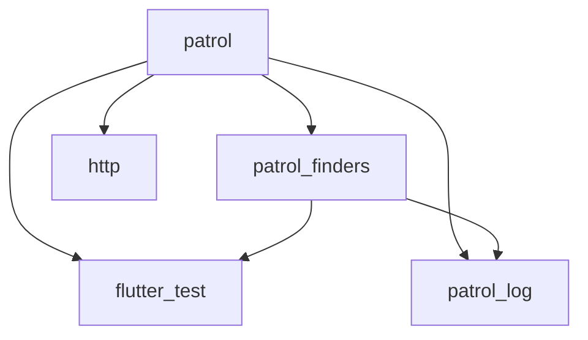

This page documents version compatibility requirements for Patrol packages and the Flutter/Dart SDKs.

## Current Requirements

The latest stable versions of Patrol require:

<CardGroup cols={2}>
  <Card title="patrol package" icon="package">
    **Version:** 4.1.1
    
    - Dart SDK: `>=3.8.0 <4.0.0`
    - Flutter SDK: `>=3.32.0`
  </Card>
  <Card title="patrol_cli" icon="terminal">
    **Version:** 4.1.0
    
    - Dart SDK: `>=3.8.0 <4.0.0`
    - Compatible with patrol: `^4.1.0`
  </Card>
  <Card title="patrol_finders" icon="magnifying-glass">
    **Version:** 3.1.0
    
    - Dart SDK: `>=3.8.0 <4.0.0`
    - Flutter SDK: `>=3.32.0`
  </Card>
  <Card title="patrol_log" icon="file-lines">
    **Version:** 0.7.1
    
    - Dart SDK: `>=3.8.0 <4.0.0`
    - No Flutter version requirement
  </Card>
</CardGroup>

## Package Compatibility Matrix

The following table shows which versions of `patrol_cli` and `patrol` are compatible with each other:

| patrol_cli version | patrol version | Minimum Flutter version | Notes |
|-------------------|----------------|------------------------|-------|
| **4.1.0+** | **4.1.0+** | **3.32.0** | ✅ Current stable |
| 4.0.2 - 4.0.x | 4.1.0+ | 3.32.0 | Compatible with newer patrol |
| 4.0.0 - 4.0.1 | 4.0.0 - 4.0.1 | 3.32.0 | Exact version match |
| 3.11.0 | 3.20.0 | 3.32.0 | |
| 3.9.0 - 3.10.0 | 3.18.0 - 3.19.0 | 3.32.0 | |
| 3.7.0 - 3.8.0 | 3.16.0 - 3.17.0 | 3.32.0 | |
| 3.5.0 - 3.6.0 | 3.14.0 - 3.15.2 | 3.24.0 | |
| 3.4.1 | 3.13.1 - 3.13.2 | 3.24.0 | |
| 3.4.0 | 3.13.0 | 3.24.0 | |
| 3.3.0 | 3.12.0 | 3.24.0 | |
| 3.2.1 | 3.11.2 | 3.24.0 | |
| 3.2.0 | 3.11.0 - 3.11.1 | 3.22.0 | |
| 3.1.0 - 3.1.1 | 3.10.0 | 3.22.0 | |
| 2.6.5 - 3.0.1 | 3.6.0 - 3.10.0 | 3.16.0 | |
| 2.6.0 - 2.6.4 | 3.4.0 - 3.5.2 | 3.16.0 | |
| 2.3.0 - 2.5.0 | 3.0.0 - 3.3.0 | 3.16.0 | |
| 2.2.0 - 2.2.2 | 2.3.0 - 2.3.2 | 3.3.0 | |
| 2.0.1 - 2.1.5 | 2.0.1 - 2.2.5 | 3.3.0 | |
| 2.0.0 | 2.0.0 | 3.3.0 | |
| 1.1.4 - 1.1.11 | 1.0.9 - 1.1.11 | 3.3.0 | ⚠️ Legacy versions |

<Info>
**Reading the table:**
- Versions marked with `+` (e.g., `4.1.0+`) indicate compatibility with all later versions
- Ranges (e.g., `3.9.0 - 3.10.0`) indicate compatibility with all versions in that range
- The minimum Flutter version applies to both packages
</Info>

## Platform Support

Different platforms have different minimum version requirements:

### Android

<Card title="Android Requirements" icon="android">
  - **Minimum SDK**: API 21 (Android 5.0 Lollipop)
  - **Target SDK**: API 34+ recommended
  - **Gradle**: 7.0+ 
  - **Kotlin**: 1.7.0+ (if using Kotlin DSL)
  - **Java**: JDK 17 (recommended)
  
  Configured in `android/app/build.gradle`:
  ```kotlin
  android {
      compileSdk = 34
      defaultConfig {
          minSdk = 21
          targetSdk = 34
      }
  }
  ```
</Card>

### iOS

<Card title="iOS Requirements" icon="apple">
  - **Minimum version**: iOS 13.0
  - **Xcode**: 14.0+
  - **CocoaPods**: 1.10.0+
  - **Swift**: 5.7+ (if using Swift code)
  
  Configured in `ios/Podfile`:
  ```ruby
  platform :ios, '13.0'
  ```
</Card>

### macOS

<Card title="macOS Requirements" icon="desktop">
  - **Minimum version**: macOS 10.14 (Mojave)
  - **Xcode**: 14.0+
  - **Status**: 🟡 Alpha support
  - **Native automation**: ⏳ Coming soon
  
  Configured in `macos/Podfile`:
  ```ruby
  platform :macos, '10.14'
  ```
</Card>

<Warning>
macOS support is in alpha stage. Some features may not work as expected, and there is no native automation support yet.
</Warning>

### Web

<Card title="Web Requirements" icon="globe">
  - **Supported browsers**:
    - Chrome/Chromium (recommended)
    - Firefox
    - Safari (limited support)
  - **Node.js**: 16.0+ (for development)
  - **Status**: ✅ Full support
  
  Run tests with:
  ```bash
  patrol test --target patrol_test/app_test.dart --platform web
  ```
</Card>

## Checking Your Versions

To check which versions you're currently using:

<CodeGroup>
```bash patrol_cli version
patrol --version
# Output: 4.1.0
```

```bash patrol package version
flutter pub deps | grep patrol
# Output:
# └── patrol 4.1.1
#     ├── patrol_finders 3.1.0
#     └── patrol_log 0.7.1
```

```bash Flutter/Dart versions
flutter --version
# Output:
# Flutter 3.32.0 • channel stable
# Dart 3.8.0
```
</CodeGroup>

## Updating Patrol

To ensure compatibility, update both packages together:

<Steps>
  <Step title="Update patrol_cli">
    ```bash
    flutter pub global activate patrol_cli
    ```
  </Step>
  
  <Step title="Update patrol package">
    ```bash
    flutter pub upgrade patrol
    ```
    
    Or specify a version in `pubspec.yaml`:
    ```yaml
    dev_dependencies:
      patrol: ^4.1.1
    ```
    Then run:
    ```bash
    flutter pub get
    ```
  </Step>
  
  <Step title="Verify compatibility">
    ```bash
    patrol doctor
    ```
  </Step>
</Steps>

<Tip>
**Best practice:** Always use the latest stable versions of both `patrol` and `patrol_cli` to ensure compatibility and get the latest features and bug fixes.
</Tip>

## Troubleshooting Version Issues

<AccordionGroup>
  <Accordion title="Error: test_bundle.dart compilation failed">
    This usually indicates a version mismatch between `patrol` and `patrol_cli`.
    
    **Solution:**
    1. Check versions: `patrol --version` and `flutter pub deps | grep patrol`
    2. Refer to the compatibility matrix above
    3. Update to compatible versions
    4. Clean and rebuild: `flutter clean && flutter pub get`
  </Accordion>

  <Accordion title="Error: Unsupported Flutter version">
    Your Flutter SDK version may be too old.
    
    **Solution:**
    1. Check your Flutter version: `flutter --version`
    2. Update Flutter: `flutter upgrade`
    3. Make sure you're on at least Flutter 3.32.0
    4. If you need to use an older Flutter version, consult the compatibility matrix for older Patrol versions
  </Accordion>

  <Accordion title="Error: Unsupported Dart SDK version">
    Your Dart SDK version may be incompatible.
    
    **Solution:**
    1. Check `pubspec.yaml` environment constraints:
       ```yaml
       environment:
         sdk: '>=3.8.0 <4.0.0'
       ```
    2. Update Flutter (which includes Dart): `flutter upgrade`
    3. Or switch to a compatible Flutter channel: `flutter channel stable`
  </Accordion>

  <Accordion title="Android build fails with 'minSdkVersion' error">
    Patrol requires Android API 21 or higher.
    
    **Solution:**
    Update `android/app/build.gradle`:
    ```kotlin
    defaultConfig {
        minSdk = 21  // Minimum for Patrol
        targetSdk = 34
    }
    ```
  </Accordion>

  <Accordion title="iOS build fails with deployment target error">
    Patrol requires iOS 13.0 or higher.
    
    **Solution:**
    1. Update `ios/Podfile`:
       ```ruby
       platform :ios, '13.0'
       ```
    2. In Xcode, set deployment target to 13.0 for both `Runner` and `RunnerUITests` targets
    3. Run: `cd ios && pod install && cd ..`
  </Accordion>
</AccordionGroup>

## Using Older Versions

If you need to use an older version of Flutter or Dart, you may need to use older versions of Patrol. Consult the compatibility matrix to find compatible versions.

<Warning>
Older versions receive limited support. We recommend upgrading to the latest stable Flutter and Patrol versions when possible.
</Warning>

### Example: Using Patrol with Flutter 3.24.0

If you're on Flutter 3.24.0, you can use:

```yaml pubspec.yaml
dev_dependencies:
  patrol: ^3.15.2
```

And install:
```bash
flutter pub global activate patrol_cli 3.6.0
```

## Patrol Dependencies

Patrol packages have the following dependency relationships:



<Info>
- `patrol` depends on `patrol_finders` and `patrol_log`
- `patrol_finders` can be used standalone in widget tests
- `patrol_log` is a shared logging utility used by both packages
</Info>

## Version Announcements

Stay updated on new releases:

- 📦 [pub.dev releases](https://pub.dev/packages/patrol/versions)
- 🐙 [GitHub releases](https://github.com/leancodepl/patrol/releases)
- 💬 [Discord announcements](https://discord.gg/ukBK5t4EZg)
- 🐦 [Twitter/X updates](https://x.com/patrol_leancode)

## Migration Guides

When upgrading between major versions, refer to our migration guides:

<CardGroup cols={2}>
  <Card title="Migrate to v4" icon="arrow-up" href="/migration/v3-to-v4">
    Upgrading from Patrol 3.x to 4.x
  </Card>
  <Card title="Native to Platform API" icon="mobile" href="/migration/native-to-platform">
    Migrate from deprecated native API
  </Card>
  <Card title="From integration_test" icon="flask" href="/migration/integration-test">
    Migrate from Flutter's integration_test
  </Card>
  <Card title="Changelog" icon="list" href="/resources/changelog">
    View all changes across versions
  </Card>
</CardGroup>

## Need Help?

If you're experiencing compatibility issues:

1. Check this compatibility matrix
2. Verify your versions with `patrol doctor`
3. Review the [troubleshooting section](#troubleshooting-version-issues)
4. Ask on [Discord](https://discord.gg/ukBK5t4EZg)
5. Open an [issue on GitHub](https://github.com/leancodepl/patrol/issues)

<Card title="Back to Getting Started" icon="arrow-left" href="/quickstart">
  Return to the quickstart guide to set up Patrol
</Card>